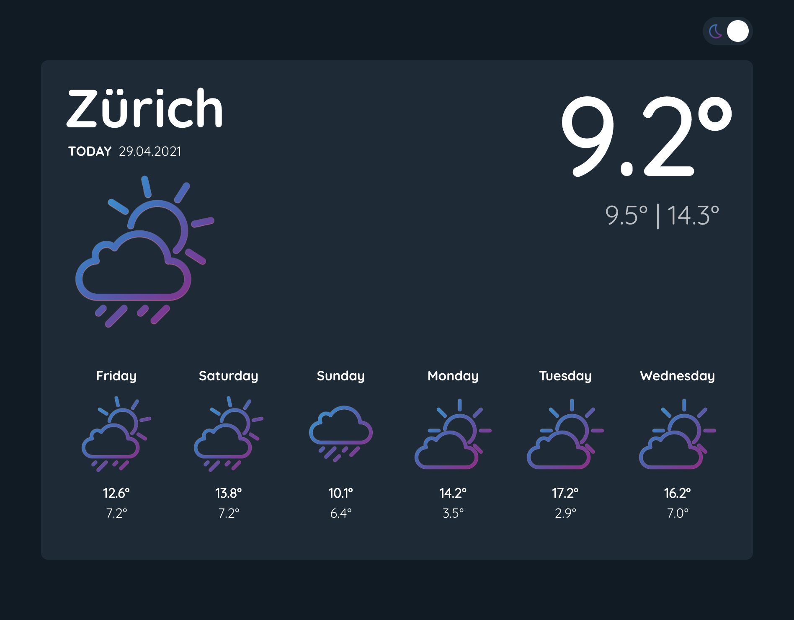

# Weather App

A simple weather App that uses the [SRF Weather API](https://developer.srgssr.ch/apis/srf-weather) to fetch Weather data.



This project was bootstrapped with [Create React App](https://github.com/facebook/create-react-app).

## Setup

Create an .env file in the root directory with the following entries:

```javascript
REACT_APP_WEATHER_CONSUMER_KEY=CONSUMER KEY
REACT_APP_WEATHER_CONSUMER_SECRET=CONSUMER SECRET
```

(Note: the SRF-MeteoProductFreemium product only allows 6 free requests/day).

## Available Scripts

In the project directory, you can run:

### `yarn start`

Runs the app in the development mode.\
Open [http://localhost:3000](http://localhost:3000) to view it in the browser.

The page will reload if you make edits.\
You will also see any lint errors in the console.

### `yarn test`

Launches the test runner in the interactive watch mode.\
See the section about [running tests](https://facebook.github.io/create-react-app/docs/running-tests) for more information.

### `yarn build`

Builds the app for production to the `build` folder.\
It correctly bundles React in production mode and optimizes the build for the best performance.

The build is minified and the filenames include the hashes.\
Your app is ready to be deployed!

See the section about [deployment](https://facebook.github.io/create-react-app/docs/deployment) for more information.
